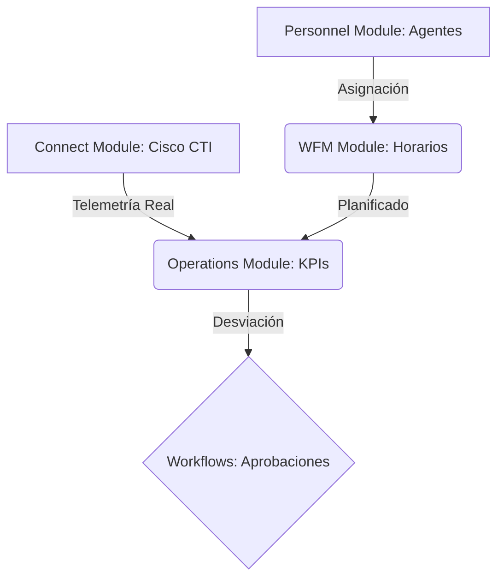

  

  
  
  
  

<h3 align="center">
  <strong>El motor inteligente de optimización operativa para el Contact Center institucional</strong>
</h3>

  Planificación relámpago, telemetría en tiempo real y flujos de autogestión sin fricción unificados en una sola verdad operacional.

 

---

## ⚡ La Revolución en la Gestión de Fuerza de Trabajo

**Antigravity** es más que un gestor de horarios; es una plataforma de **Product Engineering** diseñada para erradicar el caos de las mallas horarias manuales y las hojas de cálculo dispersas. Construido bajo los pilares del alto rendimiento y la seguridad institucional, Antigravity orquesta la planificación y la ejecución diaria del Contact Center de la **Caja de Seguro Social de Panamá**.

---

## ✨ Características Estelares

### 📅 Planificación Semanal Relámpago
Genera, valida y publica mallas horarias para cientos de operadores en segundos. 
*   Importación masiva mediante CSV inteligente con pre-validación de agentes.
*   Motor matemático que impide solapamientos y colisiones horarias en *preflight*.
*   Publicación y distribución instantánea de turnos con un solo clic.

### 👁️ Adherencia y Telemetría en Tiempo Real
Visualiza la realidad operativa al instante con nuestro tablero de monitoreo en vivo.
*   Sincronización nativa con la telefonía y estados de **Cisco Finesse**.
*   Diagrama de Gantt dinámico: Horario Planificado vs. Estados Reales del Agente.
*   Alertas instantáneas de desadherencia y excesos en tiempos auxiliares (baño, breaks).

### 🤝 Autogestión Transparente (Employee Hub)
Descentraliza la administración del tiempo libre y empodera a los agentes.
*   Solicitudes y validación dinámica de saldo de permisos trimestrales y compensatorios.
*   Intercambios de turnos (*Shift Swaps*) directos entre agentes con validación síncrona de coincidencia horaria.
*   Flujo de firmas L1/L2 automatizado para supervisores sin papeleos.

### 📊 Cerebro Analítico y Scorecards
Métricas de rendimiento estandarizadas para el análisis gerencial y de nómina.
*   Cálculo automático de KPIs: TMO (Tiempo Medio de Operación), SLA por cola y productividad.
*   Reconciliación automática nocturna de asistencia y generación de incidencias (tardanzas/faltas).
*   Inventario de Staffing unificado para análisis de cobertura y capacidad operativa.

---

## 📈 La Transformación Operativa

| Característica | Antes (Caos Operativo) | Ahora con Antigravity |
| :--- | :--- | :--- |
| **Generación de Horarios** | Días de trabajo en Excel propensos a errores. | Segundos de procesamiento con validación matemática. |
| **Solicitud de Permisos** | Formularios en papel y correos cruzados. | Solicitudes y flujos de aprobación L1/L2 en línea. |
| **Control de Asistencia** | Verificación manual contra logs del CTI. | Reconciliación automatizada nocturna con alertas. |
| **Monitoreo Diario** | Supervisión ciega o reactiva. | Telemetría en vivo de estados Cisco Finesse. |
| **Fuente de Información** | Datos dispersos en múltiples sistemas. | Una sola verdad operacional unificada. |

---

## 💬 Testimonios de la Operación

> ❝**Antigravity redujo a cero el tiempo muerto de validación horaria.** Lo que antes nos tomaba un fin de semana entero de planificación en Excel, hoy lo resolvemos e importamos en menos de 5 minutos con total certeza de que no hay solapamientos.❞
>  *— Coordinador de Workforce Management (WFM)*

> ❝Solicitar un cambio de turno con mi compañero ahora es cuestión de tres clics. El sistema valida automáticamente que nuestros horarios coincidan y notifica a mi supervisor al instante. Adiós a los correos sin respuesta.❞
>  *— Operadora del Contact Center CSS*

---

## 🛠️ Stack Tecnológico de Alto Rendimiento

Antigravity está construido como un **Monolito Modular** de alta robustez, asegurando bajo acoplamiento y máxima cohesión entre unidades de negocio:

*   **Backend Principal:** PHP 8.2+ con tipado estricto & Laravel 11.
*   **Frontend Interactivo:** Livewire 3 + TailwindCSS + FluxUI (Navegación SPA rápida con `wire:navigate`).
*   **Persistencia y Datos:** PostgreSQL (aprovechando tipos avanzados como `jsonb` y rangos `tstzrange` para colisiones).
*   **Manejo de Tareas y Colas:** Redis para procesamiento diferido asíncrono y encolamiento de notificaciones.
*   **Seguridad y Permisos:** Control de acceso basado en roles (RBAC) con Spatie Laravel-Permission.

---

## 🔒 Licencia y Seguridad

Desarrollo y software propietario &mdash; **Caja de Seguro Social de Panamá**. Todos los derechos reservados. Entorno corporativo privado y de alta seguridad. 2026.
