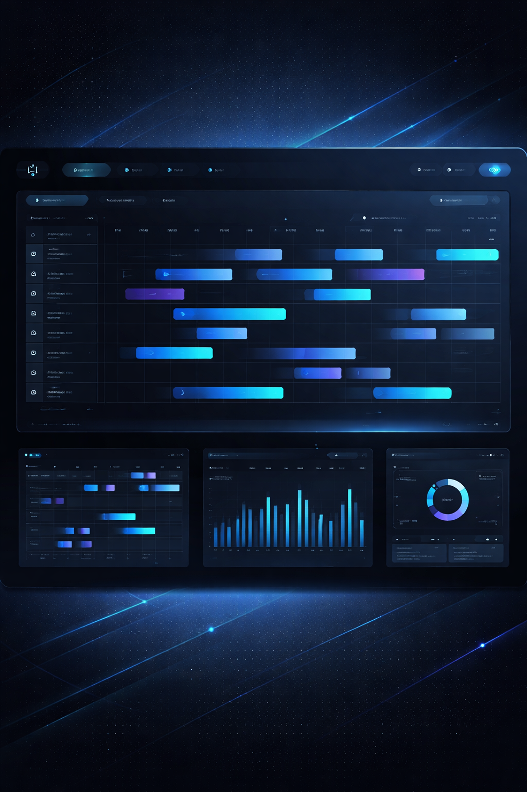

  

  <strong>Transformando la operatividad del Call Center de la Caja de Seguro Social de Panamá</strong>

 

  

 

---

## El desafío

Antes de WFM, la gestión de horarios del Call Center CSS era un laberinto de hojas de cálculo, correos interminables y procesos manuales propensos a errores. Coordinar a cientos de operadores, gestionar permisos, controlar la asistencia y medir el rendimiento exigía un esfuerzo titánico — y la información siempre llegaba tarde.

Nacimos para cambiar eso.

## Qué es WFM

**Workforce Management CSS** es la plataforma digital que unifica la planificación, la operación en tiempo real y la gestión del talento humano del Call Center. Un ecosistema donde coordinadores y agentes trabajan sobre la misma verdad operacional.

### Capacidades clave

| | |
|---|---|
| **Planificación semanal** | Horarios inteligentes sin solapamientos, con validación automática y publicación con un clic |
| **Operación en vivo** | Monitoreo de adherencia, estados de agentes y actividades intradía en tiempo real |
| **Autogestión** | Permisos, vacaciones y cambios de turno sin papeleo ni intermediarios |
| **Métricas reales** | Productividad, utilización WFM y adherencia calculadas contra la operación real (Cisco) |
| **Trazabilidad total** | Cada decisión queda registrada. Auditoría inmutable de principio a fin |

## Cómo funciona

  
  

El sistema se organiza en dominios que cubren el ciclo completo de la operación:

**Personnel** — El núcleo del talento humano. Organización, equipos, posiciones y datos del personal centralizados.

**WFM (Planning)** — El motor de horarios. Planificación semanal, actividades intradía, excepciones y publicación automatizada.

**Connect** — La integración con Cisco UCCX. Telemetría en vivo, histórico de llamadas y sincronización de estados de agente.

**Operations** — El dashboard de desempeño. Adherencia, productividad, reconciliación de asistencia y métricas en tiempo real.

**Workflows** — Los flujos de aprobación. Solicitudes de permisos, cambios de turno y aprobaciones con trazabilidad completa.

## Impacto

| Antes | Ahora |
|---|---|
| Planificación manual en Excel | Horarios generados y validados en segundos |
| Solicitudes por correo | Autogestión con aprobaciones en línea |
| Reportes tardíos | Métricas en tiempo real contra operación Cisco |
| Información dispersa | Una sola fuente de verdad |

## Tecnología

| | |
|---|---|
| Backend | PHP + Laravel |
| Frontend | Livewire + Flux UI |
| Base de datos | PostgreSQL |
| Tiempo real | WebSockets |
| Infraestructura | Entornos institucionales de alta seguridad |

## Licencia

Software propietario &mdash; **Caja de Seguro Social de Panamá**. Todos los derechos reservados. 2026.
