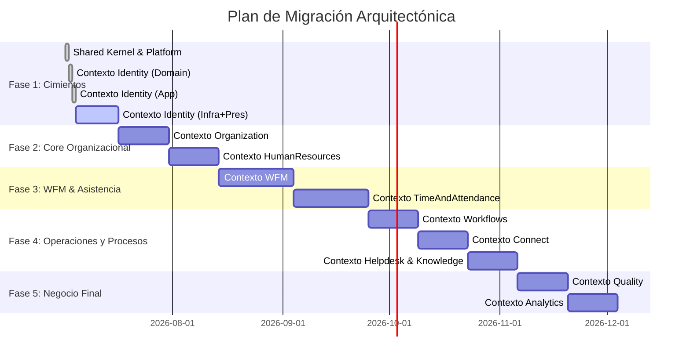

# Roadmap de Migración a Modular Monolith DDD (Strangler Fig)

Este documento define el plan ordenado por fases y sprints para migrar incrementalmente el monolito modular de `app/Modules/` a la nueva arquitectura limpia en `app/Src/`.

Cada sprint detalla las tareas por capas (`Domain`, `Application`, `Infrastructure`, `Presentation` y `Legacy Bridge`) para dar un seguimiento granular al avance.

---

## 🗺️ Resumen de Fases y Cronograma Estimado

---

## 🛠️ Desglose de Fases, Sprints y Tareas

### FASE 1: Cimentación de Plataforma e Identidad (Sprints 1-3)

**Objetivo:** Establecer el núcleo compartido (Shared Kernel), configurar las herramientas globales de infraestructura e implementar el primer Bounded Context (`Identity`) redireccionando la autenticación del legado de forma transparente.

#### Sprint 1: Shared Kernel & Platform Bootstrapping

* **Domain (Shared / Platform)**
  * [x] Definir clases base para `ValueObjects` abstractos (ej. `Uuid`, `Email`, `DateRange`).
  * [x] Definir clases base para `DomainEvent` y despachadores agnósticos al framework.
  * [x] Definir interfaces base de `Repository` y excepciones de dominio comunes.
* **Infrastructure (Platform)**
  * [x] Migrar el sistema de logs a `app/Src/Platform/Infrastructure/Persistence/EloquentAuditLog.php`.
  * [x] Mudar el adaptador de almacenamiento a `app/Src/Platform/Infrastructure/Integrations/S3StorageAdapter.php`.
  * [x] Reimplementar la pasarela de notificaciones en `app/Src/Platform/Infrastructure/Notifications/`.
  * [x] Configurar el Service Provider global de `Platform` para registrar servicios transversales.
* **Legacy Bridge**
  * [x] Reemplazar las llamadas directas de `AuditLog::log` en `app/Modules/` para que apunten al nuevo `Platform/Infrastructure` usando un helper provisional.

#### Sprint 2: Contexto Identity - Dominio & Aplicación

* **Domain (Identity)**
  * [x] Crear la entidad de dominio `User` (PHP pura, desacoplada de Eloquent).
  * [x] Crear Value Objects para `Password` (con reglas de hash internas), `Email` e `IdentityRole`.
  * [x] Definir el contrato `UserRepositoryInterface`.
  * [x] Definir eventos de dominio `UserCreated`, `UserPasswordReset`.
* **Application (Identity)**
  * [x] Crear DTOs para solicitudes de autenticación y registro (`LoginDTO`, `CreateUserDTO`).
  * [x] Implementar `AuthenticateUserHandler` resolviendo la lógica de verificación de firmas.
  * [x] Implementar `CreateUserHandler` y su correspondiente `UserMapper` (conversión Dominio <-> Eloquent).
* **Infrastructure (Identity)**
  * [x] Crear el modelo Eloquent `app/Src/Identity/Infrastructure/Persistence/EloquentUser.php`.
  * [x] Crear la implementación concreta del repositorio `app/Src/Identity/Infrastructure/Persistence/EloquentUserRepository.php`.

#### Sprint 3: Contexto Identity - Presentación & Redirección

* **Presentation (Identity)**
  * [x] Crear rutas de administración en `app/Src/Identity/Presentation/Routes/web.php`.
  * [x] Diseñar el controlador de Login y adaptarlo al frontend del legado.
  * [x] Crear componentes Livewire de administración en `app/Src/Identity/Presentation/Livewire/ManageUsers.php`.
* **Legacy Bridge**
  * [ ] Puente completo de autenticación pendiente de definir estrategia de migración gradual (Strangler Fig).
  * [ ] Reconfigurar `config/auth.php` para apuntar al nuevo modelo de usuario de `app/Src/`.
  * [ ] Asegurar que las llamadas heredadas a `Auth::user()` devuelvan de forma segura el modelo del puente o la base del framework sin romper vistas antiguas de Blade.
  * [ ] Validar en producción la entrega continua de la autenticación.

---

### FASE 2: Core Organizacional (Sprints 4-6)

**Objetivo:** Extraer la estructura organizacional y de legajo de RRHH del caótico `PersonnelModule` heredado, separándolos en dos contextos limpios.

#### Sprint 4: Contexto Organization - Organigrama & Equipos

* **Domain (Organization)**
  * [x] Crear entidades de dominio para `Directorate`, `Department`, `Team` y `Position`.
  * [x] Definir especificaciones de negocio (ej. "Un equipo no puede tener más de 20 agentes").
  * [x] Definir `OrganizationRepositoryInterface`.
* **Application (Organization)**
  * [x] Crear comandos y handlers para el mantenimiento de la estructura (`CreateTeamHandler`, `MoveEmployeeToTeamHandler`).
  * [x] Crear DTOs de lectura rápida para mallas organizativas.
* **Infrastructure (Organization)**
  * [x] Modelos Eloquent y migraciones para la estructura relacional de los equipos.
  * [x] Implementar el repositorio de base de datos.
* **Presentation & Bridge**
  * [x] Implementar la interfaz visual de gestión de equipos (Livewire).
  * [x] Endpoints API JSON para consultas de estructura organizativa desde módulos legados.

#### Sprint 5: Contexto Human Resources - Expedientes Médicos & Legales

* **Domain (HumanResources)**
  * [x] Crear entidades de dominio `EmployeeRecord` (legajo).
  * [x] Modelar datos altamente sensibles (`EmployeeDisease`, `EmployeeDisability`) como Value Objects inmutables.
* **Application (HumanResources)**
  * [x] Implementar `RegisterEmployeeDiseaseHandler` con validaciones de cifrado.
  * [x] Crear mapeadores de datos confidenciales (`EmployeeRecordMapper`).
* **Infrastructure (HumanResources)**
  * [x] Configurar políticas de cifrado condicional vía `config/human-resources.php` (toggle `HR_ENCRYPT_MEDICAL_NOTES`).
  * [x] Repositorio con bridge al modelo legacy `Employee` para carga de legajo completo.
* **Presentation & Bridge**
  * [x] Livewire `ManageMedicalRecords` protegido por permiso `employees.view`.
  * [x] Bridge al legado vía `EloquentEmployeeRecordRepository` que consume el modelo `Employee` legacy.

#### Sprint 6: Aprovisionamiento Automatizado (Cisco Integration)

* **Domain & Application (Connect)**
  * [x] Definir el puerto de integración `CiscoAprovisioningInterface`.
  * [x] Crear handler `SyncEmployeeWithCiscoHandler` activado por eventos organizacionales.
* **Infrastructure (Connect)**
  * [x] Implementar el cliente REST Guzzle contra la API de Cisco Finesse (`CiscoFinesseAdapter`).
  * [x] Agregar reintentos con retraso exponencial (Backoff) mediante Jobs de Laravel.
* **Legacy Bridge**
  * [ ] Sustituir los antiguos despachos HTTP de `PersonnelModule` por eventos de dominio (pendiente de migración completa del módulo legacy).

---

### FASE 3: WFM & Asistencia (Sprints 7-10)

**Objetivo:** Migrar los dos módulos operativos más complejos y críticos para el cálculo de nómina y planificación de turnos.

#### Sprint 7: Contexto WFM - Planificación Semanal

* **Domain (Wfm)**
  * [x] Entidades de dominio para `WeeklySchedule` y `Schedule`.
  * [x] Implementar especificaciones críticas (`NoOverlappingAssignmentsSpecification`).
  * [x] Definir `ScheduleRepositoryInterface`.
* **Application (Wfm)**
  * [x] Crear `PublishWeeklyScheduleHandler` y despachar `WeeklySchedulePublished` event.
  * [x] Crear el importador masivo en lote `ImportTeamWeeklyScheduleHandler` con chunks de 100.
* **Infrastructure (Wfm)**
  * [x] Modelos Eloquent de horarios sobre tabla existente `weekly_schedules`.
  * [x] Implementar persistencia por lotes (`EloquentScheduleAssignment::insert` chunked).
* **Presentation & Bridge**
  * [x] Migrar el panel Livewire `WeeklyPlanning` a `app/Src/Wfm/Presentation/`.

#### Sprint 8: Contexto WFM - Gestión Intra-Día (Intraday)

* **Domain (Wfm/Intraday)**
  * [x] Entidades `IntradayActivity`, `ActivityType` y `ApprovedIntradayPeriod`.
  * [x] Servicio de dominio `GetExpectedAgentStateService` para calcular el estado ideal (OFF/SHIFT/INTRADAY/EXCEPTION) en un segundo exacto.
* **Application (Wfm/Intraday)**
  * [x] Implementar `AssignIntradayActivityHandler` con validación de traslapes.
  * [x] Implementar `RescheduleBreakHandler` para re-programar descansos y breaks dinámicamente.
* **Infrastructure (Wfm/Intraday)**
  * [x] Implementar caché de Redis (`CachedIntradayService` con 60s TTL) para consultas calientes del estado esperado.
* **Presentation**
  * [x] Panel `MyDay` Livewire con estado actual del agente en tiempo real.

#### Sprint 9: Contexto Time & Attendance - Control de Marcaciones (Punch Clock)

* **Domain (TimeAndAttendance)**
  * [x] Entidad de dominio `AttendancePunch` (Marcaciones de Entrada/Salida/Break/Lunch).
  * [x] Entidad `AttendanceIncident` (Tardanza, Falta, Salida Temprana) con máquina de estados (open → justified/unjustified → resolved).
* **Application (TimeAndAttendance)**
  * [x] Crear `ProcessEmployeePunchHandler` con dispatch de `EmployeePunched` event.
  * [x] Servicio `ReconcileAttendanceHandler` para contrastar marcaciones reales vs horario esperado y generar incidencias automáticas (tardanza >5min, ausencia sin punch).
* **Infrastructure (TimeAndAttendance)**
  * [x] `IdentityValidatorInterface` + `NullIdentityValidator` (placeholder para integración futura con biométricos/SSO).

#### Sprint 10: Adherencia en Tiempo Real & Conciliación

* **Domain & Application (TimeAndAttendance)**
  * [x] Crear el motor de conciliación automatizado (`EndOfDayReconciliationService`) para generar incidencias al final de la jornada (ausencias, tardanzas >5min, salidas tempranas).
  * [x] `JustifyIncidentHandler` para justificar/resolver incidencias con máquina de estados.
  * [x] Comando `attendance:reconcile {date?}` para ejecución masiva con barra de progreso.
* **Presentation & Bridge**
  * [x] Livewire `ListIncidents` con tabla, búsqueda y formulario inline de justificación.
  * [x] `BonusCalculationBridge` para conectar incidencias con sistemas legacy de bonificaciones (conteo de injustificadas, minutos de tardanza, asistencia perfecta, resumen mensual).

---

### FASE 4: Procesos Operativos y de Soporte (Sprints 11-13)

**Objetivo:** Migrar los flujos de comunicación con telefonía CTI, base de conocimientos y la lógica del motor de aprobaciones.

#### Sprint 11: Contexto Workflows - Motor de Aprobación

* **Domain (Workflows)**
  * [x] Entidades `ApprovalRequest` (type, requesterId, payload, requiredLevels) y `ApprovalSignature` (approverId, action, level).
  * [x] Máquina de estados `WorkflowState` con transiciones formalizadas: pending → l1/l2/l3_approved → approved, con rejected/cancelled desde cualquier estado no final.
* **Application (Workflows)**
  * [x] Handlers `SubmitApprovalRequestHandler` y `ProcessApprovalHandler` con validación de state machine.
* **Infrastructure & Presentation**
  * [x] Eloquent models + repository con sync de signatures.
  * [x] Bandeja `ApprovalInbox` Livewire con tabs, aprobar/rechazar con comentario.

#### Sprint 12: Contexto Connect - Capa de Integración Telefónica (CTI)

* **Domain & Application (Connect)**
  * [x] ACL `TelephonyNormalizationService` que normaliza webhooks de Cisco y Avaya a `CallEvent` unificado.
  * [x] `CallEvent` entidad normalizada (provider-agnostic) + `CallStatus` VO + `TelephonyProvider` VO.
  * [x] `ProcessCallEventHandler` orquesta normalización, persistencia y dispatch de evento.
* **Infrastructure (Connect)**
  * [x] Adaptadores: `CiscoFinesseAdapter` (Sprint 6) + `AvayaCallAdapter` configurable vía `config/connect.php`.
  * [x] `TelephonyEventSubscriber` con handlers para webhooks Cisco/Avaya + validación de tipos de evento.
  * [x] Webhook endpoints `POST /api/connect/{provider}/webhook` para recepción de eventos en tiempo real.

#### Sprint 13: Contexto Knowledge - Base de Datos Documental

* **Domain & Application (Knowledge)**
  * [x] Consolidar lógica de artículos: entidad `Article` con título, slug, contenido, categoría, versión, estados (draft/review/published/archived), tags y colas.
  * [x] `CreateArticleHandler` con persistencia transaccional y sync de tags/queues.
  * [x] `SearchArticlesHandler` con filtros por texto, categoría y tag.
* **Presentation**
  * [x] `ArticleSearch` Livewire con búsqueda en tiempo real (debounce), filtro por categoría y grid de resultados.

---

### FASE 5: Calidad y Analítica Final (Sprints 14-16)

**Objetivo:** Migrar el control de calidad de llamadas y la capa analítica de visualización de KPI corporativos.

#### Sprint 14: Contexto Quality - Auditoría de Llamadas

* **Domain (Quality)**
  * [x] Entidades `EvaluationForm`, `EvaluationCriteria` y `AgentEvaluation` (con máquina de estados draft→completed→disputed→void).
  * [x] Regla de negocio `FatalErrorRuleService`: si cualquier criterio marcado como error crítico tiene score 0, la evaluación se anula (score=0, status=void).
* **Application (Quality)**
  * [x] `SubmitEvaluationHandler` con cálculo de score ponderado + aplicación de fatal error.
  * [x] `RaiseDisputeHandler` para apelación de notas.
* **Presentation**
  * [x] `AgentEvaluationForm` Livewire con selector de formulario, rúbrica dinámica y puntaje por criterio.

#### Sprint 15: Contexto Analytics - Procesamiento de KPIs

* **Domain & Application (Analytics)**
  * [x] `KpiCalculationService` con 12 KPIs: productivity, utilization, adherence, AHT, occupancy, serviceLevel, coverageRate, absenteeismRate, PWI, capacityCalls.
  * [x] `CalculateDailyMetricsHandler` que cruza datos de llamadas y telemetría para calcular métricas diarias por agente.
  * [x] `BatchAggregateHandler` para procesamiento masivo.
* **Infrastructure (Analytics)**
  * [x] Datamart `EloquentAgentDailyMetric` sobre tabla `agent_daily_metrics` con 20 fields de KPIs.
  * [x] `AnalyticsRepositoryInterface` con `saveMetric`, `aggregateByTeam`, `getLatestMetricsByEmployee`.
  * [x] Comando `analytics:aggregate {date?}` para agregación programada por cron/scheduler.

#### Sprint 16: Cierre de Migración, Limpieza y Depreciación

* **Pruebas de Integración**
  * [ ] Ejecución de suite completa de pruebas Pest validando de punta a punta.
* **Depreciación**
  * [ ] Desactivar definitivamente el enrutamiento y carga de Service Providers de `app/Modules/`.
  * [ ] Eliminar la carpeta `app/Modules/` (Fin del Strangler Fig Pattern).

---

## 📈 Seguimiento y Gestión del Cambio

1. **Definición de Hecho (DoD):**
   * Una tarea en `ROADMAP.md` se marca como completada `[x]` únicamente cuando el código en `app/Src/` tiene pruebas unitarias/integración con cobertura > 80% y ha sido desplegado a producción bajo el puente de transición.
2. **Actualización continua:**
   * Este roadmap debe ser actualizado al final de cada iteración por el agente a cargo de la fase correspondiente.
