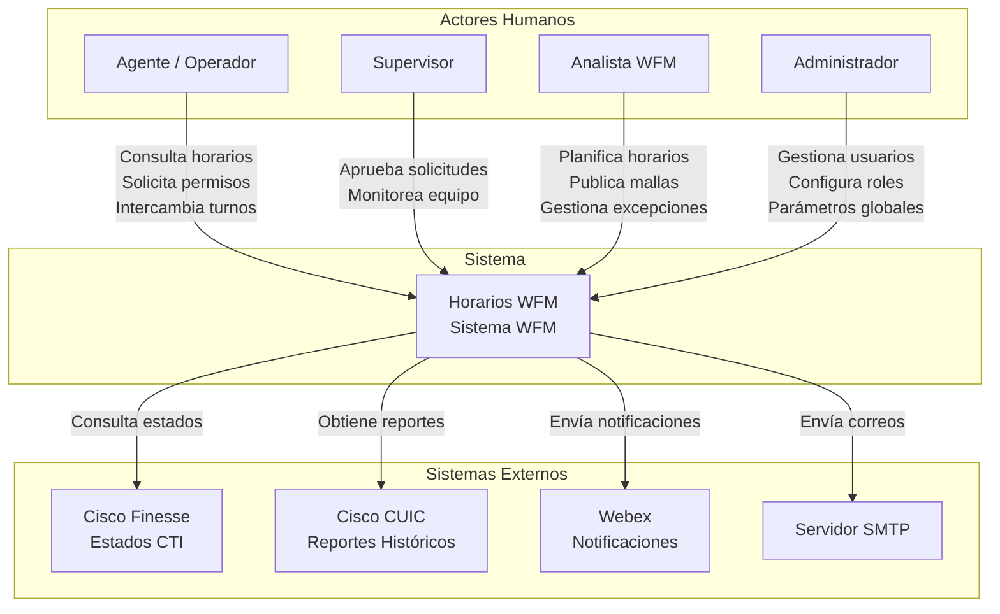
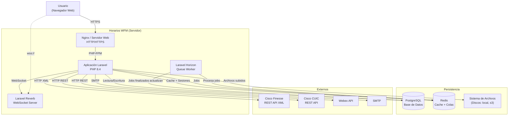
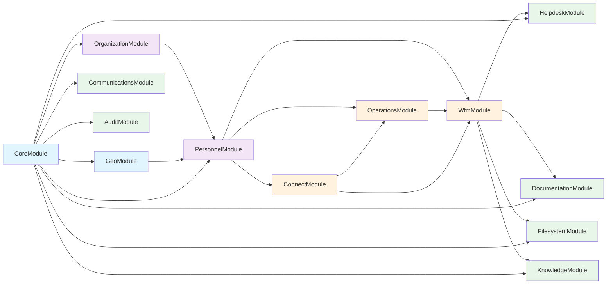
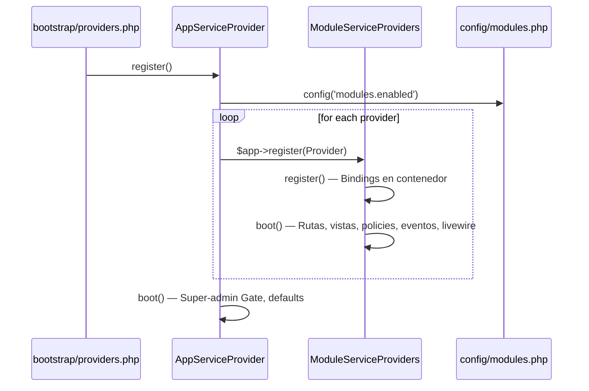
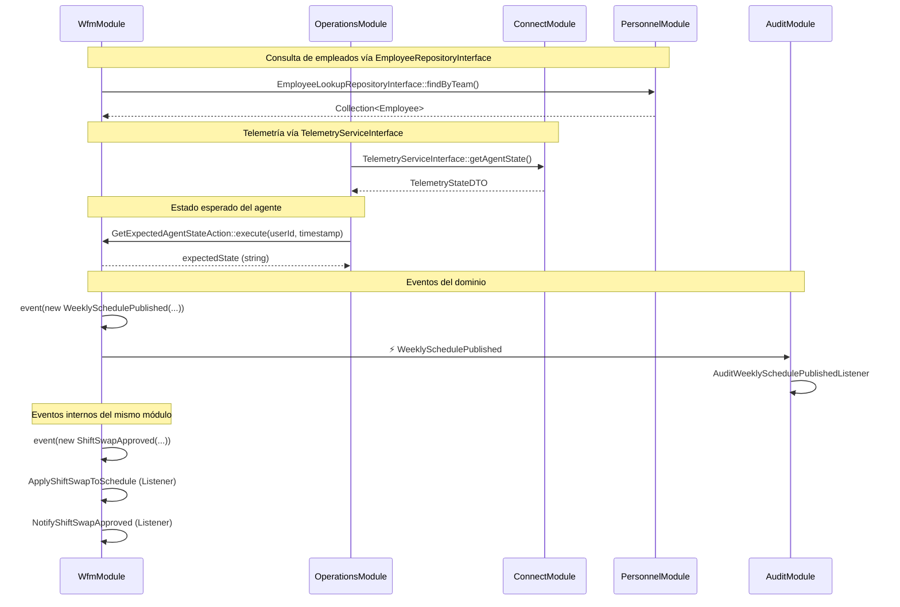
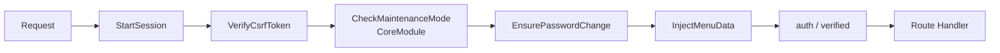
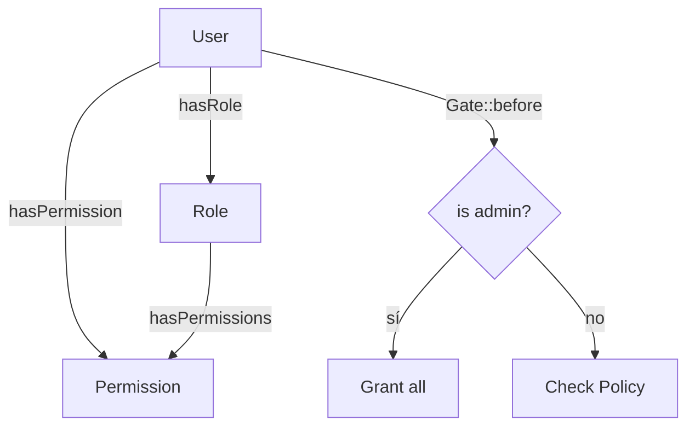

# Arquitectura del Sistema — Horarios WFM

> **Versión del documento:** 1.0
> **Última actualización:** Julio 2026
> **Clasificación:** Arquitectura General

---

## Tabla de Contenidos

1. [Resumen Ejecutivo](#1-resumen-ejecutivo)
2. [Principios Arquitectónicos](#2-principios-arquitectónicos)
3. [Vista de Contexto (C4 — Nivel 1)](#3-vista-de-contexto-c4--nivel-1)
4. [Vista de Contenedores (C4 — Nivel 2)](#4-vista-de-contenedores-c4--nivel-2)
5. [Vista de Componentes — Módulos (C4 — Nivel 3)](#5-vista-de-componentes--módulos-c4--nivel-3)
6. [Estructura del Monolito Modular](#6-estructura-del-monolito-modular)
7. [Sistema de Carga de Módulos](#7-sistema-de-carga-de-módulos)
8. [Comunicación Cross-Module](#8-comunicación-cross-module)
9. [Shared Kernel](#9-shared-kernel)
10. [Pipeline HTTP](#10-pipeline-http)
11. [Autenticación y Autorización](#11-autenticación-y-autorización)
12. [Frontend y UI](#12-frontend-y-ui)
13. [Colas y Procesamiento Asíncrono](#13-colas-y-procesamiento-asíncrono)
14. [WebSockets y Tiempo Real](#14-websockets-y-tiempo-real)
15. [Integraciones Externas](#15-integraciones-externas)
16. [Monitoreo y Observabilidad](#16-monitoreo-y-observabilidad)
17. [Tareas Programadas](#17-tareas-programadas)
18. [Testing](#18-testing)
19. [Decisiones Arquitectónicas (ADRs)](#19-decisiones-arquitectónicas-adrs)
20. [Riesgos y Deuda Técnica](#20-riesgos-y-deuda-técnica)
21. [Evolución Futura](#21-evolución-futura)

---

## 1. Resumen Ejecutivo

**Horarios WFM** es un sistema de Workforce Management para el Contact Center de la **Caja de Seguro Social de Panamá**. Su función principal es planificar, publicar y monitorear los horarios de cientos de operadores, integrando telemetría en tiempo real desde la plataforma Cisco UCCX/Finesse para calcular adherencia, productividad y otras métricas operativas.

El sistema está construido como un **Monolito Modular** sobre Laravel 13, donde 13 módulos de negocio conviven en un mismo proceso pero se comunican exclusivamente a través de contratos, eventos y DTOs compartidos, sin importaciones directas entre módulos.

---

## 2. Principios Arquitectónicos

| Principio                                 | Aplicación                                                                                                                                    |
| ----------------------------------------- | --------------------------------------------------------------------------------------------------------------------------------------------- |
| **Monolito Modular**                      | Toda la aplicación se despliega como una unidad, pero el código se organiza en módulos con dependencias explícitas y comunicación acotada     |
| **Comunicación basada en contratos**      | Los módulos se comunican mediante interfaces (`app/Shared/Contracts/`), eventos de dominio (`app/Shared/Events/`) y DTOs (`app/Shared/DTOs/`) |
| **Cero imports directos entre módulos**   | Ningún módulo importa clases de otro módulo directamente. Las dependencias se resuelven a través del contenedor de servicios de Laravel       |
| **BaseModel compartido**                  | Todos los modelos Eloquent extienden `App\Shared\Models\BaseModel` que usa ULIDs como primary keys                                            |
| **Actions con responsabilidad única**     | La lógica de negocio transaccional se encapsula en clases de acción con un único método `execute()`                                           |
| **Políticas de autorización por recurso** | Cada modelo tiene su propia Policy usando Spatie Laravel Permission                                                                           |
| **Declaración estricta de tipos**         | `declare(strict_types=1)` es obligatorio en todo archivo PHP                                                                                  |
| **Simplicidad antes que abstracción**     | Se prefiere la solución más simple que cumpla el requerimiento; se evita sobreingeniería                                                      |

---

## 3. Vista de Contexto (C4 — Nivel 1)



**Propósito del Sistema:** Orquestar la planificación, ejecución y monitoreo de la fuerza laboral del Contact Center, integrando datos de telemetría en tiempo real para garantizar la cobertura operativa y medir el desempeño de los agentes.

---

## 4. Vista de Contenedores (C4 — Nivel 2)



### Stack Tecnológico por Contenedor

| Contenedor    | Tecnología       | Versión  | Propósito                              |
| ------------- | ---------------- | -------- | -------------------------------------- |
| Servidor Web  | Nginx            | —        | Proxy inverso, SSL, archivos estáticos |
| Aplicación    | Laravel + PHP    | 13 / 8.4 | Lógica de negocio, API, UI             |
| WebSocket     | Laravel Reverb   | 1.x      | Eventos en tiempo real al navegador    |
| Queue Worker  | Laravel Horizon  | 5.x      | Procesamiento asíncrono de jobs        |
| Base de Datos | PostgreSQL       | 16       | Persistencia principal                 |
| Cache/Colas   | Redis            | 7        | Cache, sesiones, colas, locks          |
| Archivos      | Disco local / S3 | —        | Uploads, reportes, media               |

---

## 5. Vista de Componentes — Módulos (C4 — Nivel 3)

### 5.1 Mapa de Dependencias entre Módulos



> **Nota:** Las flechas indican dirección de dependencia. El módulo origen depende del módulo destino. La comunicación real se realiza mediante contratos e interfaces, no mediante importaciones directas de clases.

### 5.2 Descripción de Módulos

| #   | Módulo                   | Namespace              | Propósito                                                  | Modelos Clave                                                                        |
| --- | ------------------------ | ---------------------- | ---------------------------------------------------------- | ------------------------------------------------------------------------------------ |
| 1   | **CoreModule**           | `CoreModule`           | IAM, RBAC, autenticación Fortify, configuraciones globales | `User`, `Role`, `Permission`, `AppSetting`                                           |
| 2   | **OrganizationModule**   | `OrganizationModule`   | Estructura organizacional                                  | `Directorate`, `Department`, `Position`                                              |
| 3   | **GeoModule**            | `GeoModule`            | Geografía panameña                                         | `District`, `Township`                                                               |
| 4   | **PersonnelModule**      | `PersonnelModule`      | Empleados, equipos, asignaciones                           | `Employee`, `Team`, `TeamMember`                                                     |
| 5   | **OperationsModule**     | `OperationsModule`     | KPIs, dashboards, adherencia, productividad                | `AttendanceIncident`, `AgentDailyMetric`                                             |
| 6   | **ConnectModule**        | `ConnectModule`        | Integración Cisco UCCX/CUIC/Finesse                        | `CallRecord`, `CallQueue`, `Channel`, `AgentStateTransition`                         |
| 7   | **CommunicationsModule** | `CommunicationsModule` | Noticias, encuestas, shoutouts, comentarios                | `News`, `Poll`, `Shoutout`, `Comment`                                                |
| 8   | **AuditModule**          | `AuditModule`          | Auditoría de eventos, exportación                          | `AuditLog`                                                                           |
| 9   | **WfmModule**            | `WfmModule`            | Planificación semanal, turnos, swaps, permisos, intradía   | `Schedule`, `WeeklySchedule`, `LeaveRequest`, `ShiftSwapRequest`, `IntradayActivity` |
| 10  | **HelpdeskModule**       | `HelpdeskModule`       | Tickets de soporte, SLA                                    | `HelpdeskTicket`, `HelpdeskTicketComment`                                            |
| 11  | **DocumentationModule**  | `DocumentationModule`  | Wiki/documentación interna                                 | `DocumentationArticle`                                                               |
| 12  | **FilesystemModule**     | `FilesystemModule`     | Archivos, carpetas, descargas, cuotas                      | `File`, `Folder`, `FileShare`, `StorageQuota`                                        |
| 13  | **KnowledgeModule**      | `KnowledgeModule`      | Base de conocimiento operativo                             | `KnowledgeArticle`, `KnowledgeCategory`, `KnowledgeQueue`                            |

### 5.3 Estructura Canónica de un Módulo

```
app/Modules/{Module}/
├── Actions/                    # Lógica transaccional (único método execute())
│   └── Realtime/               # (solo WfmModule) Acciones de tiempo real
├── Console/Commands/           # Comandos Artisan propios del módulo
├── Database/Migrations/        # Migraciones específicas (opcional)
├── DTOs/                       # Objetos de transferencia inmutables (Spatie Data)
├── Emails/                     # Clases Mailable (opcional)
├── Enums/                      # Enums PHP (opcional)
├── Events/                     # Eventos de dominio del módulo
├── Http/
│   ├── Controllers/            # Controladores HTTP (si aplica)
│   └── Requests/               # Form Requests
├── Jobs/                       # Queue jobs del módulo
├── Listeners/                  # Manejadores de eventos
├── Livewire/                   # Componentes UI reactivos
│   └── Forms/                  # Livewire Form Objects
├── Mail/                       # Clases Mailable adicionales
├── Models/                     # Modelos Eloquent (extienden BaseModel)
├── Notifications/              # Clases de notificación
├── Observers/                  # Observers de ciclo de vida
├── Policies/                   # Políticas de autorización (Spatie)
├── Providers/
│   └── ModuleServiceProvider.php  # Registration + Boot
├── Repositories/               # (opcional) Repositorios
├── Resources/Views/            # Vistas Blade
│   └── livewire/               # Vistas de componentes Livewire
├── Routes/
│   ├── web.php                 # Rutas web del módulo
│   └── api.php                 # (opcional) Rutas API
└── Services/                   # Servicios de negocio
```

---

## 6. Estructura del Monolito Modular

### 6.1 Árbol de Directorios (Nivel Superior)

```
app/
├── Concerns/                   # Traits reutilizables (PasswordValidationRules, etc.)
├── Console/Commands/           # Comandos Artisan globales (CiscoSync, Communications*)
├── Helpers/                    # Helpers globales (toast.php)
├── Http/Middleware/            # Middleware de aplicación
├── Modules/                    # 13 módulos de negocio
├── Notifications/              # Canales de notificación globales (WebexChannel)
├── Providers/                  # AppServiceProvider, HorizonServiceProvider, WebexNotificationProvider
├── Reports/                    # Generación de reportes
├── Services/                   # Servicios globales (WebexService)
└── Shared/                     # Kernel compartido
    ├── Contracts/              # Interfaces para comunicación cross-module
    ├── DTOs/                   # DTOs compartidos
    ├── Events/                 # Eventos de dominio cross-module
    ├── Infrastructure/         # Infraestructura compartida (CiscoFinesseClient)
    ├── Models/                 # BaseModel
    ├── Notifications/          # BaseNotification, Concerns
    ├── Services/               # Servicios compartidos (MenuDataService)
    └── Support/                # Utilidades (MetricFormulas)
```

### 6.2 Sistema de Archivos y Namespaces

| Path                    | Namespace               | Propósito                       |
| ----------------------- | ----------------------- | ------------------------------- |
| `app/`                  | `App\`                  | Código fuente principal         |
| `app/Modules/{Module}/` | `App\Modules\{Module}\` | Módulos de negocio              |
| `app/Shared/`           | `App\Shared\`           | Kernel compartido entre módulos |
| `database/factories/`   | `Database\Factories\`   | Fábricas de modelos             |
| `database/seeders/`     | `Database\Seeders\`     | Seeders de base de datos        |

---

## 7. Sistema de Carga de Módulos

### 7.1 Flujo de Initialización



### 7.2 Código de Carga

**`bootstrap/providers.php`** registra los proveedores raíz:

```
AppServiceProvider::class
HorizonServiceProvider::class
WebexNotificationServiceProvider::class
FluxServiceProvider::class
```

**`AppServiceProvider::register()`** itera `config('modules.enabled')` y registra cada `ModuleServiceProvider`:

```php
foreach (config('modules.enabled', []) as $provider) {
    if (class_exists($provider)) {
        $this->app->register($provider);
    }
}
```

### 7.3 Orden de Carga y Dependencias

El orden en `config/modules.php` respeta dependencias:

1. **CoreModule** — Sin dependencias de otros módulos. Auth, RBAC, usuarios
2. **OrganizationModule** — Depende de CoreModule (usuarios). Direcciones, departamentos
3. **GeoModule** — Depende de CoreModule. Geografía panameña
4. **PersonnelModule** — Depende de CoreModule, OrganizationModule, GeoModule. Empleados, equipos
5. **OperationsModule** — Depende de PersonnelModule. KPIs, dashboards
6. **ConnectModule** — Depende de PersonnelModule. Integración Cisco
7. **CommunicationsModule** — Depende de CoreModule. Noticias, encuestas
8. **AuditModule** — Depende de CoreModule. Auditoría
9. **WfmModule** — Depende de PersonnelModule, ConnectModule. Planificación WFM
10. **HelpdeskModule** — Depende de CoreModule, WfmModule (opcional). Tickets
11. **DocumentationModule** — Depende de CoreModule. Wiki
12. **FilesystemModule** — Depende de CoreModule. Archivos
13. **KnowledgeModule** — Depende de CoreModule. Base de conocimiento

---

## 8. Comunicación Cross-Module

### 8.1 Principios

1. **Sin imports directos entre módulos.** Ningún módulo hace `use App\Modules\OtroModulo\...`
2. **La comunicación se realiza mediante:**
   - **Contracts (Interfaces):** Definidos en `app/Shared/Contracts/`. Implementados por el módulo proveedor, consumidos por otros módulos
   - **Events:** Definidos en `app/Shared/Events/`. Emitidos por un módulo, escuchados por otros
   - **DTOs:** Definidos en `app/Shared/DTOs/`. Objetos inmutables para transferencia de datos
   - **Service Container Bindings:** Los módulos registran bindings `Interface → Implementation` en su `register()`
3. **Eventos cross-module** son la única forma de comunicación asíncrona entre módulos

### 8.2 Contratos (Shared/Contracts)

| Carpeta       | Contrato                                                                                                               | Módulo Proveedor |
| ------------- | ---------------------------------------------------------------------------------------------------------------------- | ---------------- |
| `Employees/`  | `EmployeeInterface`, `EmployeeRepositoryInterface`, `EmployeeLookupRepositoryInterface`                                | PersonnelModule  |
| `Identity/`   | `UserInterface`                                                                                                        | CoreModule       |
| `Operations/` | `AgentPerformanceRepositoryInterface`                                                                                  | OperationsModule |
| `Schedules/`  | `ScheduleServiceInterface`, `ScheduleRepositoryInterface`, `LeaveRequestServiceInterface`, `ShiftSwapServiceInterface` | WfmModule        |
| `Telemetry/`  | `TelemetryServiceInterface`, `TelemetryRealtimeRepositoryInterface`                                                    | ConnectModule    |

### 8.3 Eventos del Dominio (Shared/Events)

| Evento                      | Emisor    | Escuchadores                                                               |
| --------------------------- | --------- | -------------------------------------------------------------------------- |
| `WeeklySchedulePublished`   | WfmModule | AuditModule (audita el evento)                                             |
| `LeaveRequestCreated`       | WfmModule | AuditModule                                                                |
| `LeaveRequestDecision`      | WfmModule | AuditModule                                                                |
| `ScheduleAssignmentUpdated` | WfmModule | —                                                                          |
| `ShiftSwapApproved`         | WfmModule | WfmModule (ApplyShiftSwapToSchedule, NotifyShiftSwapApproved), AuditModule |
| `ShiftSwapRequested`        | WfmModule | —                                                                          |

### 8.4 DTOs Compartidos (Shared/DTOs)

| DTO                  | Propósito                                            |
| -------------------- | ---------------------------------------------------- |
| `AdherenceStatusDTO` | Estado de adherencia de un agente en un momento dado |
| `NotificationDTO`    | Datos para construir una notificación                |
| `TimelineItemDTO`    | Elemento de línea de tiempo para dashboards          |
| `ScheduleDayDTO`     | Representación de un día de horario                  |
| `TelemetryStateDTO`  | Estado de telemetría desde Cisco                     |

### 8.5 Diagrama de Comunicación entre Módulos



---

## 9. Shared Kernel

### 9.1 BaseModel

Todos los modelos extienden `App\Shared\Models\BaseModel`:

```php
abstract class BaseModel extends Model
{
    use HasUlids;

    public $incrementing = false;
    protected $keyType = 'string';
}
```

**Implicaciones:**
- Todos los IDs son ULIDs (26 caracteres alfanuméricos)
- Sin auto-increment; los IDs se generan antes de la inserción
- Compatible con sistemas distribuidos (sin contención de secuencia)

### 9.2 Infraestructura Compartida

**`CiscoFinesseClient`** (`app/Shared/Infrastructure/Cisco/`): Cliente HTTP para la API REST XML de Cisco Finesse. Proporciona:
- `getAgentInfo(loginId)` — Estado actual del agente
- `getAgentDialogs(loginId)` — Diálogos/llamadas activos
- `getAllUsers()` — Lista de todos los agentes

### 9.3 Métricas Compartidas

**`MetricFormulas`** (`app/Shared/Support/Metrics/`): Librería de fórmulas estandarizadas consumida por OperationsModule y otros:
- `productivity()`, `utilization()`, `occupancy()`
- `aht()`, `asa()`, `serviceLevel()`
- `checkAdherence()`, `checkLate()`
- `coverageRate()`, `absenteeismRate()`

### 9.4 Notificaciones Compartidas

**`BaseNotification`** (`app/Shared/Notifications/`): Clase base para todas las notificaciones.
**`HasWebexSupport`** (`app/Shared/Notifications/Concerns/`): Trait para notificaciones que soportan envío a Webex.
**`WebexChannel`** (`app/Notifications/Channels/`): Canal de notificación personalizado para Webex.

---

## 10. Pipeline HTTP

### 10.1 Middleware Global

Configurado en `bootstrap/app.php`, se agregan al grupo `web`:



| Middleware             | Origen                       | Propósito                                                         |
| ---------------------- | ---------------------------- | ----------------------------------------------------------------- |
| `CheckMaintenanceMode` | `CoreModule\Http\Middleware` | Bloquea acceso si el modo mantenimiento está activo               |
| `EnsurePasswordChange` | `app/Http/Middleware`        | Redirige a cambio de contraseña si `force_password_change = true` |
| `InjectMenuData`       | `app/Http/Middleware`        | Inyecta conteos para badges del menú (aprobaciones pendientes)    |

### 10.2 Middleware por Ruta

- `auth` — Usuario autenticado
- `verified` — Email verificado (Fortify)
- `role:admin` — Solo rol admin (usado en Horizon, Pulse)

### 10.3 Manejo de Excepciones

- `PostTooLargeException` se captura globalmente y retorna respuesta JSON para Livewire o redirect con error

---

## 11. Autenticación y Autorización

### 11.1 Autenticación (Laravel Fortify)

- **Login:** Rate limit 5/min por email+IP
- **2FA:** TOTP con códigos de recuperación. Rate limit 5/min
- **Registro:** Deshabilitado
- **Verificación de email:** Obligatoria para acceder a rutas protegidas
- **Cambio de contraseña forzado:** Al primer inicio (`force_password_change`)
- **Confirmación de contraseña:** Para acciones sensibles (settings), con bypass si el usuario está forzado a cambiar

### 11.2 Autorización (Spatie Laravel Permission)



- **Roles:** `admin`, `wfm`, `supervisor`, `evaluator`, `agent`, etc.
- **Permisos:** Nomenclatura `{recurso}.{accion}` (ej. `news.create`, `schedules.manage`)
- **Super-admin bypass:** `Gate::before()` en `AppServiceProvider::boot()` otorga acceso total al rol `admin`
- **Cache de permisos:** 24 horas en Redis. Se purga al modificar roles/permisos
- **Policies:** Por modelo, registradas en cada `ModuleServiceProvider`

### 11.3 Sesiones

- **Driver:** `database` (tabla `sessions`)
- **Lifetime:** 120 minutos
- **Cookie:** `SameSite=Lax`, `HttpOnly`

---

## 12. Frontend y UI

### 12.1 Stack

| Capa             | Tecnología   | Versión |
| ---------------- | ------------ | ------- |
| Framework UI     | Livewire     | 4.x     |
| Componentes      | Flux UI      | 2.x     |
| CSS              | TailwindCSS  | 4.x     |
| Iconos           | Lucide       | —       |
| WebSocket Client | Laravel Echo | 2.x     |
| Build tool       | Vite         | —       |

### 12.2 Arquitectura de Componentes Livewire

- Cada módulo registra sus componentes en `ModuleServiceProvider::boot()` mediante `Livewire::component()`
- Los componentes se registran con prefijo del módulo: `wfm.my-schedule`, `core.users.list-users`
- Las vistas Blade asociadas viven en `Resources/Views/livewire/` de cada módulo
- Namespaces adicionales en `config/livewire.php`: `layouts`, `pages`, `employees`, `schedule`

### 12.3 Layout

- **Layout principal:** `resources/views/layouts/app.blade.php`
- **Sidebar:** Persistente, con soporte de colapso, iconos + etiquetas
- **Navbar:** Minimal, con breadcrumbs visibles siempre
- **Namespaces de vistas:** `reports::`, `core::`, `wfm::`, etc. registrados por módulo

### 12.4 Navegación

- Rutas web definidas centralmente en `routes/web.php` (home, dashboard)
- Rutas de settings en `routes/settings.php` (profile, appearance, security)
- Rutas de módulos cargadas desde `Routes/web.php` de cada módulo con prefijos como `admin/wfm/`, `admin/audit/`, etc.

---

## 13. Colas y Procesamiento Asíncrono

### 13.1 Infraestructura

- **Driver:** Redis (vía Horizon)
- **Horizon Dashboard:** `/horizon` (protegido con `role:admin`)

### 13.2 Colas y Supervisores

| Cola            | Propósito               | Supervisor     | Procesos (prod) | Timeout |
| --------------- | ----------------------- | -------------- | --------------- | ------- |
| `default`       | Jobs generales          | supervisor-1   | hasta 10 (auto) | 60s     |
| `notifications` | Notificaciones          | supervisor-1   | hasta 10 (auto) | 60s     |
| `wfm-heavy`     | Cálculos intensivos WFM | supervisor-wfm | 5 (simple)      | 300s    |

### 13.3 Jobs Identificados

- **ConnectModule:** Sincronización Cisco UCCX/CUIC, transiciones de estado
- **WfmModule:** Notificaciones de horario publicado, aprobación de swaps
- **CommunicationsModule:** Notificaciones de contenido programado

### 13.4 Estrategia de Balanceo

| Entorno    | supervisor-1          | supervisor-wfm              |
| ---------- | --------------------- | --------------------------- |
| Producción | `auto` scaling (time) | `simple` (5 procesos fijos) |
| Local      | 3 procesos máx        | No disponible               |

---

## 14. WebSockets y Tiempo Real

### 14.1 Infraestructura

- **Servidor:** Laravel Reverb 1.x
- **Cliente:** Laravel Echo 2.x

### 14.2 Canales

| Canal                  | Tipo    | Propósito                                |
| ---------------------- | ------- | ---------------------------------------- |
| `App.Models.User.{id}` | Privado | Notificaciones en tiempo real al usuario |

### 14.3 Casos de Uso

- Notificaciones push de aprobaciones de swaps y permisos
- Actualización de contadores en el menú (badges de aprobaciones pendientes)

---

## 15. Integraciones Externas

### 15.1 Cisco UCCX / Finesse

| Aspecto                 | Detalle                                                                     |
| ----------------------- | --------------------------------------------------------------------------- |
| **Propósito**           | Obtener estados de agentes en tiempo real (Ready, Not Ready, Talking, etc.) |
| **Protocolo**           | HTTP REST con autenticación básica                                          |
| **Formato**             | XML (parseado a array con `simplexml`)                                      |
| **Configuración**       | `config/contact-center.php`: `cisco.base_url`, `username`, `password`       |
| **Cliente**             | `app/Shared/Infrastructure/Cisco/CiscoFinesseClient.php`                    |
| **Endpoints**           | `User/{loginId}`, `User/{loginId}/Dialogs`, `Users`                         |
| **Tolerancia a fallos** | Timeout 15s, SSL verification deshabilitable                                |

### 15.2 Cisco CUIC

| Aspecto           | Detalle                                                                                                                                                                                    |
| ----------------- | ------------------------------------------------------------------------------------------------------------------------------------------------------------------------------------------ |
| **Propósito**     | Reportes históricos de desempeño de agentes y colas                                                                                                                                        |
| **Protocolo**     | HTTP REST con autenticación básica                                                                                                                                                         |
| **Formato**       | JSON                                                                                                                                                                                       |
| **Configuración** | `config/contact-center.php`: `cuic.*`                                                                                                                                                      |
| **Reportes**      | 7 reportes mapeados por UUID: `agent_state_transitions`, `agent_detail`, `agent_performance_detail`, `agent_csq_detail`, `voice_csq_summary`, `agent_chat_detail`, `agent_realtime_detail` |
| **Workaround**    | Reporte `agent_detail` con HTTP 500 al usar filtro POST → se usa `agent_state_transitions` + filtro en memoria                                                                             |

### 15.3 Webex

| Aspecto                       | Detalle                                                    |
| ----------------------------- | ---------------------------------------------------------- |
| **Propósito**                 | Envío de notificaciones a equipos/salas Webex              |
| **Servicio**                  | `app/Services/WebexService.php`                            |
| **Canal**                     | `app/Notifications/Channels/WebexChannel.php`              |
| **Provider**                  | `WebexNotificationServiceProvider` registra bindings       |
| **Soporte en notificaciones** | Trait `HasWebexSupport` en notificaciones que lo requieren |

### 15.4 Shell Scripts de Producción

| Script                | Propósito                                         |
| --------------------- | ------------------------------------------------- |
| `start-cisco-sync.sh` | Loop de sincronización continua con Cisco Finesse |
| `start-cuic-sync.sh`  | Loop de sincronización continua con CUIC          |
| `worker-cron.sh`      | Gestión de workers Horizon en producción          |

---

## 16. Monitoreo y Observabilidad

### 16.1 Laravel Pulse

- **URL:** `/pulse`
- **Middleware:** `web + role:admin`
- **Recorders activos:**

| Recorder               | Propósito                                 |
| ---------------------- | ----------------------------------------- |
| `CacheInteractions`    | Hit/miss ratio de caché                   |
| `Exceptions`           | Excepciones no capturadas                 |
| `Queues`               | Throughput y latencia de colas            |
| `SlowJobs`             | Jobs que exceden el umbral                |
| `SlowOutgoingRequests` | Llamadas HTTP lentas a servicios externos |
| `SlowQueries`          | Queries > 500ms                           |
| `Servers`              | CPU, memoria del servidor                 |
| `UserRequests`         | Requests lentas por usuario               |
| `UserJobs`             | Jobs lentos por usuario                   |

### 16.2 Laravel Horizon

- **URL:** `/horizon`
- **Middleware:** `web + role:admin`
- **Métricas:** Snapshots de jobs, colas (retención 24h)

---

## 17. Tareas Programadas

Definidas en `routes/console.php`:

| Comando                                      | Frecuencia   | Propósito                               |
| -------------------------------------------- | ------------ | --------------------------------------- |
| `communications:publish-scheduled`           | Cada 5 min   | Publica contenido programado (noticias) |
| `communications:auto-archive`                | Cada hora    | Archiva contenido expirado              |
| `communications:send-expired-poll-reminders` | Cada hora    | Recordatorios de encuestas por vencer   |
| `communications:send-newsletter`             | Diario 08:00 | Envío de newsletter                     |
| `schedules:compile-daily-snapshots`          | Diario 02:00 | Snapshots diarios de horarios           |
| `uccx:auto-import`                           | Cada hora    | Importación automática desde UCCX       |
| `operations:reconcile-attendance`            | Diario 03:00 | Reconciliación nocturna de asistencia   |

> Todas las tareas usan `->withoutOverlapping()` para evitar ejecuciones concurrentes.

---

## 18. Testing

### 18.1 Configuración

- **Framework:** Pest 4.x
- **Base de datos:** SQLite en memoria (`:memory:`)
- **TestCase base:** Seeds `RolesAndPermissionsSeeder` en `setUp()`
- **Driver de sesión:** `array`
- **Driver de caché:** `array`
- **Driver de cola:** `sync`
- **BCRYPT rounds:** 4

### 18.2 Estructura de Tests

```
tests/
├── Feature/
│   ├── Auth/               # Autenticación, verificación, 2FA
│   ├── Core/               # CRUD usuarios, RBAC
│   ├── Employees/          # Importación, exportación, policies
│   ├── Organization/       # Estructura organizacional
│   ├── Location/           # Catálogos geográficos
│   ├── Settings/           # Perfil, seguridad
│   ├── Audit/              # Auditoría
│   └── Modules/            # Tests por módulo
│       ├── AuditModule/
│       ├── CommunicationsModule/
│       ├── ContactCenter/
│       ├── HelpdeskModule/
│       ├── Operations/
│       ├── OperationsModule/
│       ├── PersonnelModule/
│       ├── ScheduleModule/
│       └── WfmModule/
└── Unit/
    └── Modules/            # Tests unitarios (sin DB)
```

### 18.3 Comandos

| Comando                                        | Propósito                                       |
| ---------------------------------------------- | ----------------------------------------------- |
| `composer test`                                | `config:clear → pint --test → php artisan test` |
| `php artisan test --compact --filter=TestName` | Test específico                                 |
| `vendor/bin/pint --format agent`               | Corregir estilo de código                       |

---

## 19. Decisiones Arquitectónicas (ADRs)

### ADR-001: Monolito Modular vs Microservicios

**Contexto:** El sistema necesita desplegarse en un entorno institucional con recursos limitados.

**Decisión:** Monolito Modular Laravel.

**Alternativas descartadas:**
- **Microservicios:** Descartado por sobrecarga operativa (múltiples deploys, bases de datos distribuidas, consistencia eventual) desproporcionada para el tamaño del equipo y la institución.

**Consecuencias:**
- Un solo deploy, una sola base de datos
- Comunicación entre módulos requiere disciplina de no importar clases directamente
- Escalamiento horizontal del monolito, no por servicio

---

### ADR-002: ULIDs como Primary Keys

**Contexto:** Necesidad de identificadores únicos no secuenciales para seguridad (no exponer volumen de datos) y compatibilidad con sistemas distribuidos.

**Decisión:** ULIDs sobre `HasUlids` trait de Laravel.

**Alternativas descartadas:**
- **Auto-increment integers:** Exponen el volumen de datos, problemas en merges/migraciones
- **UUIDs v4:** Más largos (36 chars), sin ventaja temporal para ordenamiento
- **UUIDs v7:** Buena opción, pero mayor complejidad de implementación que ULIDs nativos de Laravel

**Consecuencias:**
- Todas las FK son strings de 26 caracteres
- Mayor espacio en índices vs integers
- Sin contención de secuencia en escrituras concurrentes

---

### ADR-003: Eventos del Dominio para Comunicación Cross-Module

**Contexto:** Los módulos no deben importarse directamente entre sí.

**Decisión:** Eventos de Laravel definidos en `app/Shared/Events/` para comunicación asíncrona entre módulos.

**Alternativas descartadas:**
- **Llamadas directas a Actions de otros módulos:** Violaría el principio de no acoplamiento
- **Message Bus / RabbitMQ:** Sobrecarga innecesaria para un monólito modular

**Consecuencias:**
- Comunicación desacoplada y registrable (auditable)
- Los listeners pueden ser sincrónicos o encolados
- No hay garantía de entrega en orden (para eso están las transacciones de BD)

---

### ADR-004: Contratos con Service Container Bindings

**Contexto:** Los módulos necesitan consumir servicios de otros módulos sin conocer su implementación.

**Decisión:** Interfaces en `app/Shared/Contracts/` con implementaciones registradas en el Service Container de Laravel.

**Ejemplo:**
```php
// ConnectModule/Providers/ModuleServiceProvider.php
$this->app->singleton(
    TelemetryServiceInterface::class,
    TelemetryService::class
);
```

**Alternativas descartadas:**
- **Traits reutilizables:** No resuelven el problema de polimorfismo en runtime
- **Facades:** Mayor acoplamiento implícito

**Consecuencias:**
- Fácil de mockear en tests
- Permite cambiar implementaciones sin modificar consumidores
- Binding explícito en ServiceProvider

---

### ADR-005: Base de Datos Única PostgreSQL

**Contexto:** Sistema institucional con datos altamente relacionados.

**Decisión:** Una sola base de datos PostgreSQL con esquemas bien definidos.

**Alternativas descartadas:**
- **Base de datos por módulo:** Incrementa la complejidad de joins y consistencia transaccional
- **Base de datos separada para telemetría:** Se considerará si el volumen de datos lo requiere en el futuro

**Consecuencias:**
- Joins directos entre tablas de diferentes módulos (aunque idealmente no deberían ocurrir)
- Una sola conexión de base de datos
- Backup y restauración simple

---

### ADR-006: Session y Cache en Base de Datos (default)

**Contexto:** Entorno institucional sin Redis dedicado inicialmente.

**Decisión:** Session driver = `database`, Cache driver = `database` (Redis usado para permisos y colas).

**Consecuencias:**
- Las sesiones persisten en BD (no se pierden al reiniciar Redis)
- Mayor latencia que Redis para session/cache
- Redis sigue disponible para permisos Spatie y colas Horizon

---

### ADR-007: Tablas Públicas del Núcleo (users y employees)

**Contexto:** 37 de las 58 foreign keys (64%) entre tablas de distintos módulos referencian `users` o `employees`. Cada módulo que necesita asociar un registro a una persona física (creador, responsable, agente) lo hace mediante FK a estas tablas. Este es un acoplamiento inevitable por el dominio del problema.

**Decisión:** `users` y `employees` se declaran **tablas públicas del núcleo**. Todo módulo puede referenciarlas mediante FK directa. No se requiere abstraer estas dependencias detrás de contratos para la capa de esquema.

**Justificación:**
- El modelo relacional requiere estas FK para integridad referencial
- `users` (CoreModule) es la identidad del sistema (autenticación, RBAC)
- `employees` (PersonnelModule) es la entidad operativa (agentes, supervisores)
- No existe un modelo de negocio que desacople una "persona" de su representación en estas tablas a nivel de base de datos
- Cualquier abstracción (repositorio, DTO) añade latencia y complejidad sin eliminar el acoplamiento real

**Reglas de uso:**
- Las FK son aceptables. Las queries directas a estas tablas desde otros módulos NO lo son (deben usar `EmployeeRepositoryInterface` o `UserInterface`)
- La capa de infraestructura (migraciones, modelos) puede referenciar las tablas directamente
- La capa de aplicación (Actions, Services, Livewire) debe usar los contratos definidos en `app/Shared/Contracts/`
- Cualquier módulo nuevo debe referenciar `employees` o `users` solo mediante FK, no mediante lógica de negocio que acceda directamente a estas tablas

**Riesgos aceptados:**
- Migrar estas tablas a otro servicio requeriría revertir esta decisión y crear puntos de integración
- Cambios en el esquema de `employees` o `users` tienen alto impacto por la cantidad de dependientes

**Contexto:** Entorno institucional sin Redis dedicado inicialmente.

**Decisión:** Session driver = `database`, Cache driver = `database` (Redis usado para permisos y colas).

**Consecuencias:**
- Las sesiones persisten en BD (no se pierden al reiniciar Redis)
- Mayor latencia que Redis para session/cache
- Redis sigue disponible para permisos Spatie y colas Horizon

---

## 20. Riesgos y Deuda Técnica

### 20.1 Riesgos Identificados

| Riesgo                                        | Impacto                                                            | Probabilidad | Mitigación                                                           |
| --------------------------------------------- | ------------------------------------------------------------------ | ------------ | -------------------------------------------------------------------- |
| **Acoplamiento por Base de Datos Compartida** | Módulos podrían depender implícitamente de tablas de otros módulos | Media        | `users` y `employees` declaradas tablas públicas del núcleo (ADR-007). Para el resto, queries vía contratos |
| **Crecimiento de audit_logs**                 | Degradación de performance en consultas de auditoría               | Alta         | Prune job (`AuditPruneCommand`), particionamiento por fecha          |
| **Volumen de call_records**                   | Tabla de llamadas crece rápidamente                                | Alta         | Archivado, retención configurable                                    |
| **Disponibilidad de Cisco UCCX/Finesse**      | Los dashboards de tiempo real quedan sin datos si Cisco cae        | Alta         | Degradación gradual: cache de último estado conocido                 |
| **Concurrencia en planificación semanal**     | Dos analistas publicando horarios simultáneamente                  | Baja         | Locks optimistas con `->withoutOverlapping()`                        |

### 20.2 Deuda Técnica Documentada

| ID        | Descripción                                                                            | Prioridad |
| --------- | -------------------------------------------------------------------------------------- | --------- |
| **DT-01** | RUP docs desactualizados (describen `bigint` PK cuando el proyecto usa ULIDs)          | Alta      |
| **DT-02** | `.github/instructions/main.instructions.md` referencia `docs/technical/` que no existe | Alta      |
| **DT-03** | Versiones inconsistentes entre README (Laravel 11), AGENTS.md (Laravel 13) y realidad  | Alta      |
| **DT-04** | Falta de documentación de los eventos del dominio Shared/Events                        | Media     |
| **DT-05** | QualityModule/docs describe sistema legacy PHP separado dentro del mismo repositorio   | Media     |
| **DT-06** | `CiscoFinesseClient::get()` tiene código comentado que oculta errores HTTP             | Media     |
| **DT-07** | No hay tests para `MetricFormulas`, `MenuDataService`, `CiscoFinesseClient`            | Media     |
| **DT-08** | Caché de permisos Spatie con TTL de 24h (cambios no se reflejan inmediatamente)        | Baja      |

---

## 21. Evolución Futura

### 21.1 Mejoras Planificadas

1. **Documentación de Eventos:** Crear catálogo completo de eventos del dominio con emisores, listeners y casos de uso
2. **API REST pública:** Exponer endpoints para integración con sistemas externos (nómina, RRHH)
3. **Cache distribuida:** Migrar session y cache a Redis dedicado para mejorar performance
4. **Arquitectura hexagonal por módulo:** Evolucionar cada módulo hacia puertos y adaptadores
5. **Separación de telemetría:** Evaluar base de datos separada (TimeScaleDB) para datos de telemetría de alto volumen

### 21.2 Candidatos a Microservicios

Si el monolito creciera más allá de la capacidad del equipo, los siguientes módulos son candidatos naturales a separarse:

- **ConnectModule:** Por su carga de sincronización constante con sistemas externos
- **OperationsModule:** Por sus necesidades de agregación de datos en tiempo real

---

## Referencias

| Documento                          | Ubicación                                        |
| ---------------------------------- | ------------------------------------------------ |
| Design System y UI Tokens          | `AGENTS.md`                                      |
| Guía de desarrollo                 | `.github/instructions/main.instructions.md`      |
| Especificaciones RUP por módulo    | `docs/RUP/*.md`                                  |
| Documentación de integración Webex | `docs/CommunicationModule/WebexImplementaion.md` |
| Módulo de Calidad (sistema legacy) | `docs/QualityModule/`                            |
| Configuración de contact center    | `config/contact-center.php`                      |
| Configuración de Horizon           | `config/horizon.php`                             |
| Configuración de módulos           | `config/modules.php`                             |
| Código fuente del Shared Kernel    | `app/Shared/`                                    |

---

Recomendaciones por Prioridad
Alta (accionable inmediatamente)
1. [x] Resucitar o eliminar UserInterface - O se implementa en User y se usa, o se elimina. El estado actual es ruido cognitivo.
2. [x] Sanear AgentPerformanceRepositoryInterface - Usar DTOs en lugar de modelos concretos en las firmas. La fuga de abstracción propaga acoplamiento a todos los consumidores.
3. [x] Auditar OperationsModule Livewire - Extraer lógica de consultas a repositorios/acciones. Los 12+ componentes Livewire que hacen queries directas a 4 módulos distintos deben delegar a Actions que usen contratos.
Media (planificar en próximo ciclo)
4. [x] Migrar PerformanceService a contratos - Reemplazar las 10+ queries directas a modelos ConnectModule/WfmModule por llamadas a TelemetryServiceInterface, ScheduleServiceInterface y nuevos contratos.
5. [x] Contrato para AgentRealtimeState - Crear TelemetryRealtimeRepositoryInterface para que OperationsModule no importe modelos ConnectModule en Livewire.
6. [x] Relaciones Eloquent vía contratos - Evaluar si las relaciones Eloquent cross-module en Models deben reemplazarse por métodos que usen repositorios (trade-off: pierdes lazy loading, ganas desacoplamiento).
Baja (deseable, no urgente)
7. [x] Contrato para CsqRealtimeStat y CallRecord - Cubierto por TelemetryRealtimeRepositoryInterface en app/Shared/Contracts/Telemetry/.
8. [x] Documentar employees y users como tablas "públicas del núcleo" - Formalizado en ADR-007. Aceptado como dependencia arquitectónica.