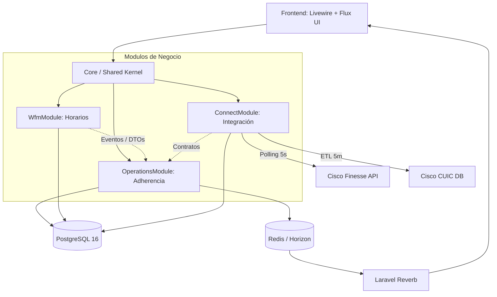
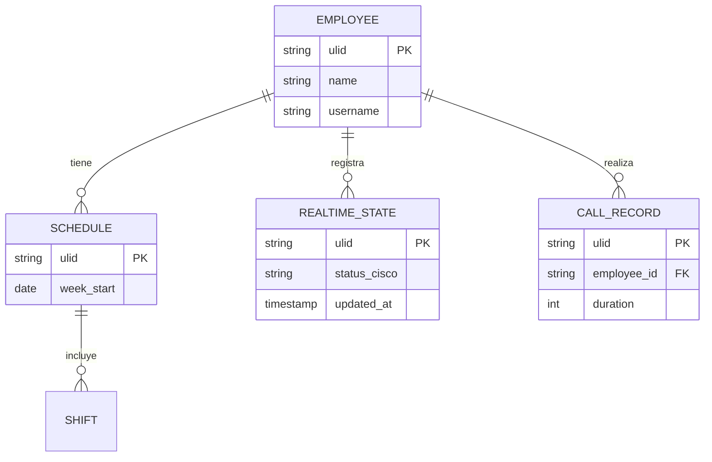

# 03 — Arquitectura

## 1. Resumen de la Solución
HorariosWFM está construido como un **Monolito Modular** en Laravel 13 y PHP 8.3+. En lugar de desplegar múltiples microservicios, el sistema mantiene una base de datos única y un solo despliegue, pero divide estrictamente su código en 15 dominios (módulos) aislados. La comunicación entre módulos se realiza exclusivamente mediante Eventos, DTOs inmutables y Contratos (Interfaces), garantizando bajo acoplamiento y alta cohesión.

## 2. Principios Guía
- **Acciones sobre Servicios (Actions, not Services)**: La lógica de negocio reside en clases `Action` transaccionales (un caso de uso por Action). Prohibido usar *Fat Controllers*.
- **Inmutabilidad y Trazabilidad**: Las llaves primarias lógicas son **ULID**. Toda modificación crítica guarda un log inmutable (before/after en JSON).
- **Desacoplamiento Estricto**: Un módulo no puede importar modelos Eloquent de otro módulo directamente.
- **Rendimiento**: Prevención estricta de N+1 (`Model::preventLazyLoading()` activo) y uso de *strict_types* en todo PHP.

## 3. Stack Tecnológico

| Capa              | Tecnología              | Justificación breve                                                                                   | Alternativas descartadas |
|-------------------|-------------------------|-------------------------------------------------------------------------------------------------------|--------------------------|
| **Frontend**      | Livewire 4 + Flux UI 2  | UI reactiva sin escribir JS. Flux UI provee componentes enterprise listos para usar con TailwindCSS 4.| React / Vue (SPA pura)   |
| **Backend**       | PHP 8.3+ / Laravel 13   | Ecosistema robusto y maduro, excelente soporte de tooling y comunidad. Monolito Modular nativo.       | Node.js / Python         |
| **Base de datos** | PostgreSQL 16           | Funciones avanzadas como `jsonb`, `tstzrange` para colisiones de horarios, y `UNLOGGED TABLES`.       | MySQL / MongoDB          |
| **Colas / Caché** | Redis (Laravel Horizon) | Procesamiento rápido en memoria de notificaciones, ETL masivos y sincronización en tiempo real CTI.   | RabbitMQ / SQS           |
| **WebSockets**    | Laravel Reverb + Echo   | Dashboards y notificaciones en vivo integradas al ecosistema Laravel.                                 | Pusher (externo)         |
| **Auth**          | Laravel Fortify         | Backend headless de autenticación con 2FA y verificación de emails. Autorización via Spatie Permission| Laravel Breeze           |

## 4. Vista Lógica (Componentes)

### Componentes Principales
| Componente              | Responsabilidad                          | Tecnologías          |
|-------------------------|------------------------------------------|----------------------|
| **Livewire Components** | Orquestación de la UI, delegación.       | Livewire 4, PHP      |
| **Livewire Forms**      | Validación estricta de formularios UI.   | Livewire 4           |
| **Actions**             | Ejecuta la lógica transaccional y BD.    | PHP 8.3, Eloquent    |
| **ConnectModule (ETL)** | Cliente HTTP y sincronizador de Cisco.   | Laravel HTTP Client  |

## 5. Vista de Despliegue
- **Entornos**: Local (SQLite/PostgreSQL dev) / Producción (PostgreSQL 16)
- **Infraestructura**: Despliegue tradicional (Systemd) o contenedorizado.
- **Servicios en Background**: 
  - `scheduler.service` (`php artisan schedule:work`): Ejecuta el cron (ETL de CUIC).
  - `horizon.service`: Procesa colas Redis (`default`, `notifications`, `realtime-sync`, `wfm-heavy`).
- **Resiliencia (Cisco)**: *Circuit breakers* y *backoff exponencial* en la integración de llamadas para evitar "Dead cycles" y degradación.

## 6. Modelo de Datos (alto nivel)

*(Nota: Las tablas intensivas en escrituras como `agent_realtime_states` son `UNLOGGED` en Postgres para maximizar rendimiento sin escribir en WAL)*

## 7. Decisiones Arquitectónicas Clave (ADRs)
1. **ULID sobre UUID**: Ordenables lexicográficamente, lo que mejora la indexación y rendimiento de B-Tree en PostgreSQL frente a UUID v4.
2. **Spatie Permission con Super-Bypass**: Uso del nivel jerárquico 99 para el admin mediante `Gate::before()`, simplificando enormemente las comprobaciones.
3. **Métricas Canónicas Desacopladas**: Las fórmulas de Adherencia, Erlang-C y KPIs residen en `app/Shared/Support/Metrics/` (clases estáticas y puras) para ser reutilizadas en Actions sin I/O directo.
