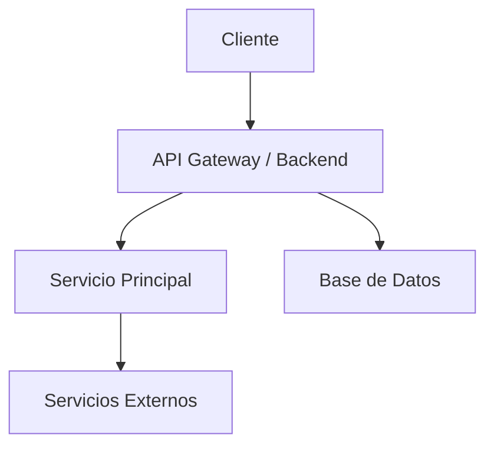
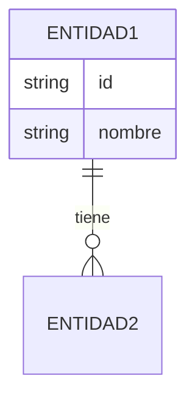

# 03 — Arquitectura

## 1. Resumen de la Solución
<!-- 3-6 líneas. ¿Qué estamos construyendo y cuál es el enfoque principal? -->

## 2. Principios Guía
<!-- Principios que gobiernan las decisiones técnicas de este proyecto -->
- 
- 
- 

## 3. Stack Tecnológico

| Capa              | Tecnología              | Justificación breve                  | Alternativas descartadas |
|-------------------|-------------------------|--------------------------------------|--------------------------|
| Frontend          |                         |                                      |                          |
| Backend           |                         |                                      |                          |
| Base de datos     |                         |                                      |                          |
| Infraestructura   |                         |                                      |                          |
| Auth              |                         |                                      |                          |
| Otros             |                         |                                      |                          |

## 4. Vista Lógica (Componentes)

<!-- Actualiza el diagrama según la realidad del proyecto -->

### Componentes Principales
| Componente              | Responsabilidad                          | Tecnologías          |
|-------------------------|------------------------------------------|----------------------|
|                         |                                          |                      |
|                         |                                          |                      |
|                         |                                          |                      |

## 5. Vista de Despliegue
<!-- Dónde y cómo corre -->
- **Entornos**: Desarrollo / Staging / Producción
- **Infraestructura**:
- **CI/CD**:
- **Observabilidad** (logs, métricas, tracing):

## 6. Modelo de Datos (alto nivel)
<!-- Entidades principales y relaciones. No hace falta el modelo completo aquí -->

## 7. Decisiones Arquitectónicas Clave (ADRs)

### ADR-001 — 
**Estado**: Propuesta / Aceptada / Deprecada  
**Contexto**:  
**Decisión**:  
**Consecuencias**:
- Positivas:
- Negativas:
- Riesgos:

---

### ADR-002 — 
**Estado**:  
**Contexto**:  
**Decisión**:  
**Consecuencias**:

<!-- Las decisiones importantes también se registran/enlazan en [[05-Decisiones]] -->

## 8. Trade-offs Principales
| Decisión                    | Beneficio principal              | Costo / Riesgo principal         |
|-----------------------------|----------------------------------|----------------------------------|
|                             |                                  |                                  |
|                             |                                  |                                  |

## 9. Seguridad
- Autenticación:
- Autorización:
- Protección de datos:
- Secretos y configuración:
- Amenazas principales consideradas:

## 10. Escalabilidad y Rendimiento
- Carga esperada:
- Cuellos de botella previstos:
- Estrategia de escalado:
- Caching:

## 11. Riesgos Técnicos
| Riesgo técnico                     | Impacto | Mitigación                        |
|------------------------------------|---------|-----------------------------------|
|                                    |         |                                   |
|                                    |         |                                   |

## 12. Preguntas Abiertas
- [ ] 
- [ ] 

---

**Relacionado**
- [[01-Vision-y-Alcance]]
- [[02-Requisitos]]
- [[04-Backlog]]
- [[05-Decisiones]]
- [[06-Riesgos]]
- [[00-Index]]
