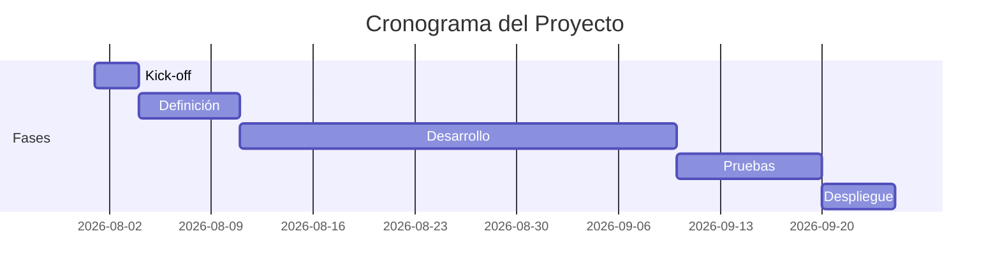

# Plan del Proyecto  
**{{Nombre del Proyecto}}**

## 1. Información General
| Campo                    | Valor                         |
|--------------------------|-------------------------------|
| Cliente / Sponsor        |                               |
| Responsable del proyecto |                               |
| Fecha de inicio          |                               |
| Fecha objetivo de entrega|                               |
| Duración estimada        |                               |
| Método de trabajo        |                               |

## 2. Objetivos del Plan
<!-- Qué debe lograr este plan (no el proyecto en sí) -->
- Dar visibilidad de hitos y fechas
- Facilitar el seguimiento semanal
- Identificar desviaciones temprano

## 3. Fases e Hitos

| Fase / Hito                    | Descripción                              | Fecha inicio | Fecha fin   | Responsable | Estado      | Entregable principal      |
|--------------------------------|------------------------------------------|--------------|-------------|-------------|-------------|---------------------------|
| Kick-off                       |                                          |              |             |             |             |                           |
| Definición / Alcance           |                                          |              |             |             |             | [[01-Vision-y-Alcance]]   |
| Diseño / Arquitectura          |                                          |              |             |             |             | [[03-Arquitectura]]       |
| Desarrollo                     |                                          |              |             |             |             |                           |
| Pruebas                        |                                          |              |             |             |             |                           |
| Despliegue                     |                                          |              |             |             |             |                           |
| Cierre y aceptación            |                                          |              |             |             |             |                           |

**Estados**: `Pendiente` · `En curso` · `Completado` · `Retrasado` · `Cancelado`

## 4. Cronograma Resumen

<!-- Actualiza las fechas reales -->

## 5. Recursos

| Rol / Persona              | Responsabilidad principal              | Disponibilidad | Notas          |
|----------------------------|----------------------------------------|----------------|----------------|
|                            |                                        |                |                |
|                            |                                        |                |                |

## 6. Dependencias Críticas
| Dependencia                        | Tipo          | Impacto si falla      | Mitigación / Acción              | Responsable |
|------------------------------------|---------------|-----------------------|----------------------------------|-------------|
|                                    | Interna/Externa |                     |                                  |             |
|                                    |               |                       |                                  |             |

## 7. Hitos de Facturación (alineados a comercial)
| Hito de pago                       | Condición                              | Fecha objetivo | Estado   |
|------------------------------------|----------------------------------------|----------------|----------|
| Anticipo                           | Firma + factura                        |                |          |
| Hito intermedio                    |                                        |                |          |
| Pago final                         | Aceptación                             |                |          |

## 8. Gestión de Cambios
- Todo cambio de alcance, fecha o costo debe documentarse y aprobarse antes de ejecutarse.
- Referencia: proceso definido en [[Comercial/Contrato-Borrador]] y [[05-Decisiones]].

## 9. Comunicación y Seguimiento
| Tipo de reunión / reporte     | Frecuencia     | Participantes              | Objetivo                        |
|-------------------------------|----------------|----------------------------|---------------------------------|
| Status interno                | Semanal        |                            | Revisar avance y blockers       |
| Status con cliente            |                |                            |                                 |
| Revisión de riesgos           | Quincenal      |                            | Actualizar [[06-Riesgos]]       |

## 10. Criterios de Éxito del Plan
- [ ] Hitos principales cumplidos en fecha (o con desviación controlada)
- [ ] Desviaciones detectadas y comunicadas a tiempo
- [ ] Riesgos críticos con plan de mitigación activo
- [ ] Alineación permanente entre alcance, tiempo y costo

## 11. Riesgos del Plan
<!-- Solo los que afectan fechas, recursos o dependencias. El detalle vive en [[06-Riesgos]] -->

| Riesgo                             | Impacto en el plan      | Mitigación rápida               |
|------------------------------------|-------------------------|---------------------------------|
|                                    |                         |                                 |

---

**Documentos relacionados**
- [[00-Index]]
- [[04-Backlog]]
- [[06-Riesgos]]
- [[Gestion/Estado]]
- [[Comercial/Propuesta-Comercial]]
